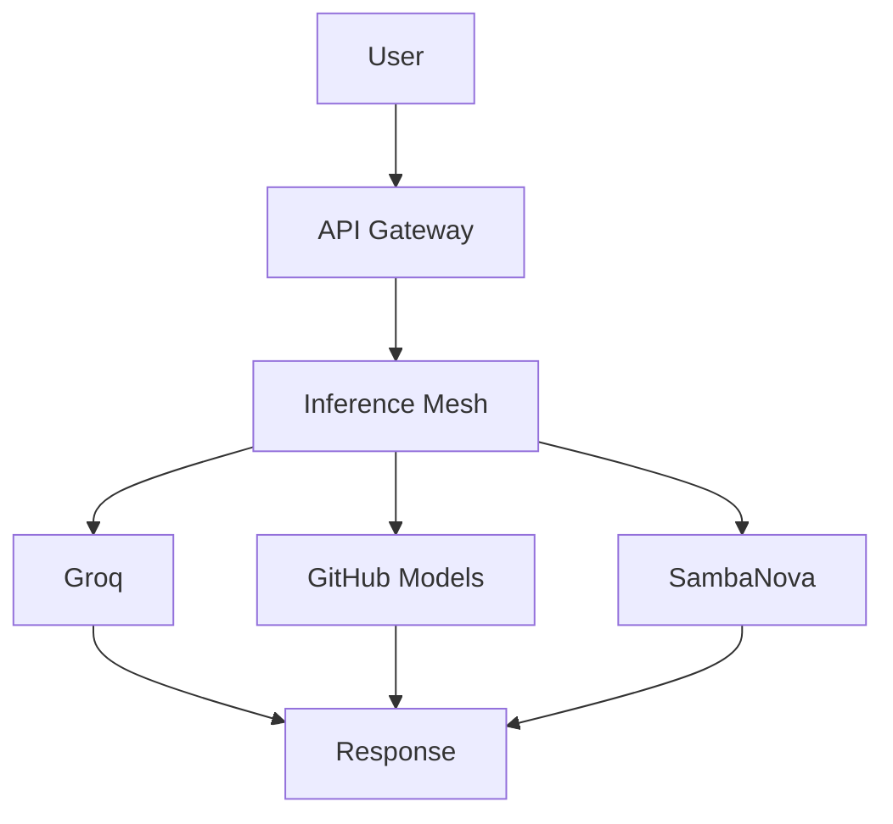

[](https://github.com/EvezArt/evez-platform)
[](LICENSE)
[](https://npmjs.com/package/evez-platform)


# EVEZ Platform - Autonomous Execution Fabric

## What is EVEZ?
A drop-in execution control layer for AI workloads that makes them self-healing, cost-aware, and fully observable.

## Quick Start
```bash
git clone https://github.com/evez/evez-platform
cd evez-platform
./scripts/install.sh
```

## Architecture
- **Control Plane**: Orchestrates tasks, manages tenants, tracks metrics
- **Workers**: Execute tasks with optimal model selection
- **API Gateway**: Multi-tenant entry point with auth & quotas
- **SDK**: Python client for developers

## Usage
```python
from evez import EvezClient

client = EvezClient("your-api-key")
task_id = client.submit_task({"task": "analyze data", "complexity": 2})
status = client.get_status(task_id)
```

## Marketplace
Pre-built templates for:
- LLM fine-tuning pipelines
- Financial signal processing
- Data cleaning workflows

## Pricing
- Free: 100 tasks/month
- Pro: $99/month - 10,000 tasks
- Enterprise: Custom

## Documentation
See wiki for full docs.

## Architecture


